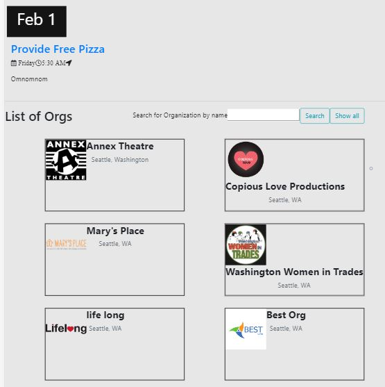
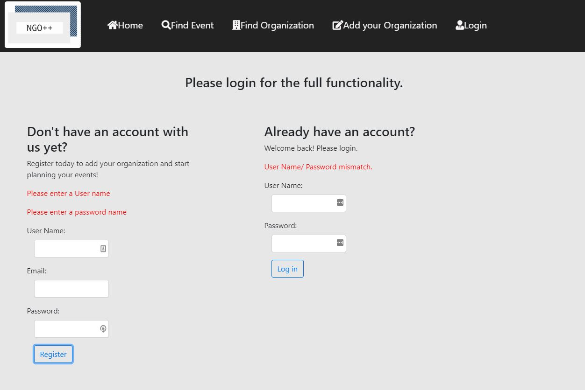
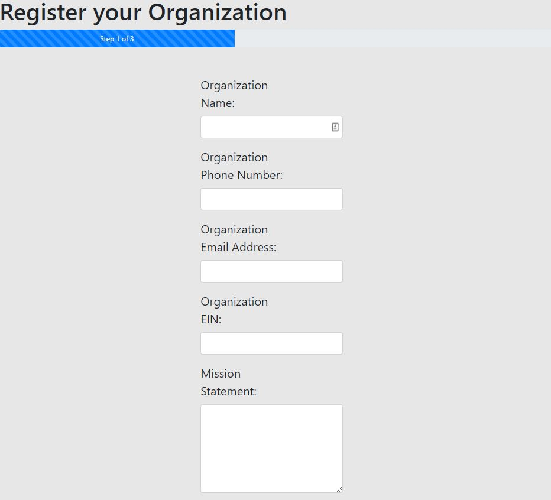
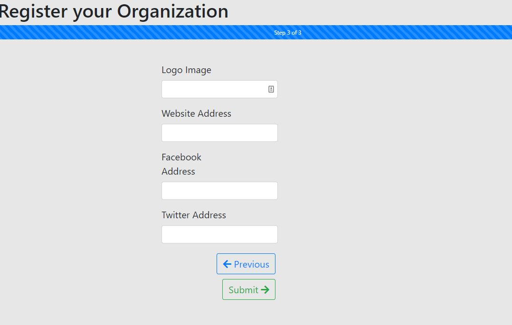
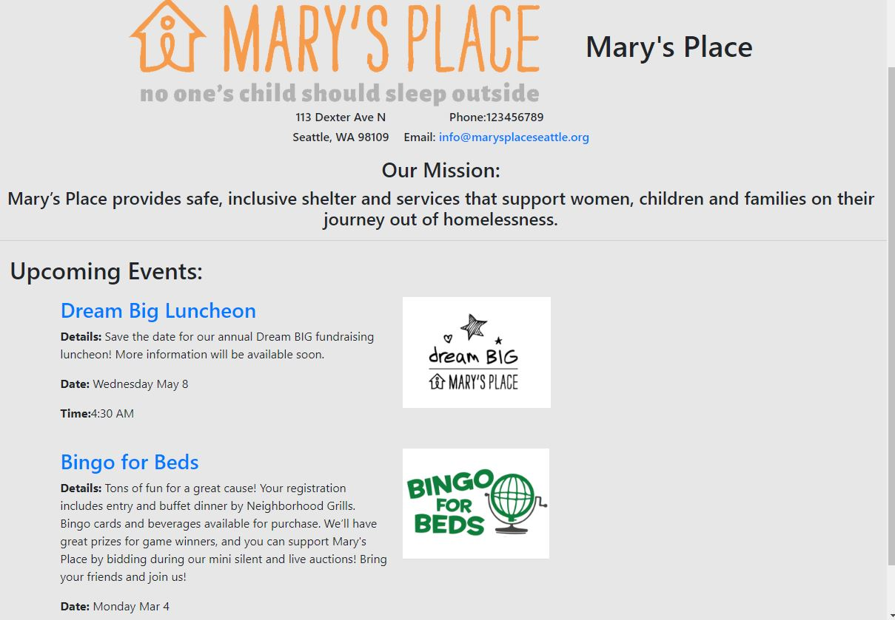
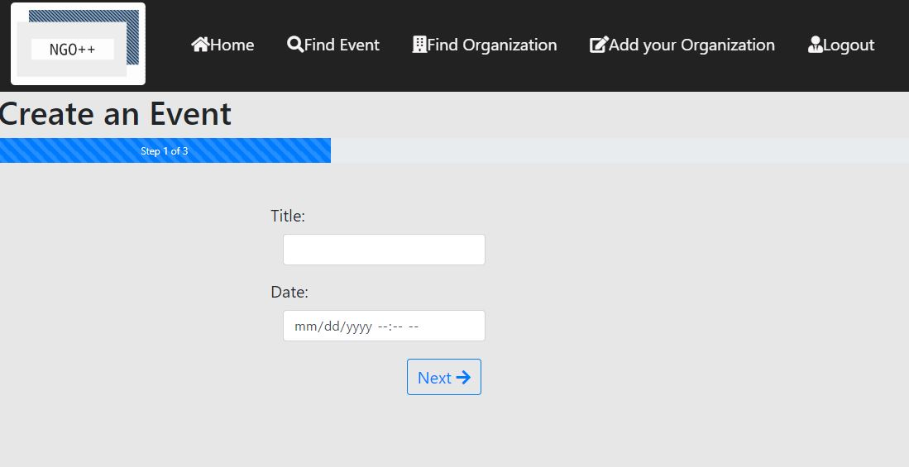
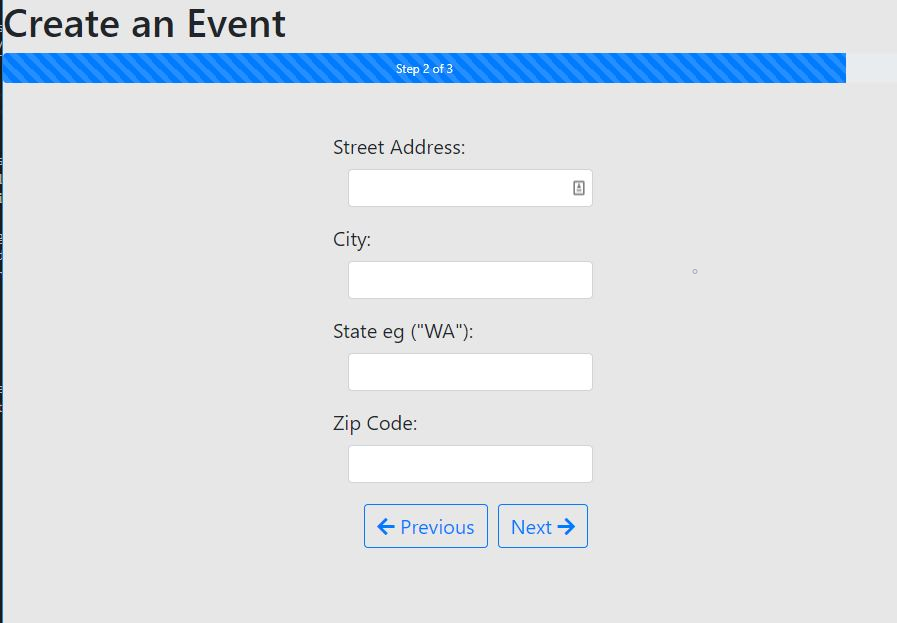

# NGO++
NGO plus plus is a website for Non-Profit Organizations to post and co-sponsor events with other organizations. This was done as a group project for final presentation. 

## Technologies used:
- JavaScript
- Express
- Angular
- Node JS
- HTML
- CSS
- Bootstrap
- MongoDB
- mongoose
- Google maps API
- GitHub
- Amazon Web Services EC2
- Postman API
- modularization

## Features:
- Searchable list of events

- Searchable list of Organizations

- User registration and login
- Form verificaction and encrypted password

- Register organization

- View organization details with list of events

- Add admins for organization
- Create event 

- Post messages on events 
- Co-sponsor event
- View event location on google maps

- User level verification on multiple functionalities
    - Add new organization (logged in)
    - Join as admin (logged in)
    - Edit organization details (organization admin)
    - Add new event (organization admin)
    - Co-sponsor event (organization admin)
    - Post message on event (logged in) 

## Database:
- User 
- Organization (one to many with user as admin)
- Event (many to many with organization as hosts, one to many with message)
- Message (many to one with user as authors)